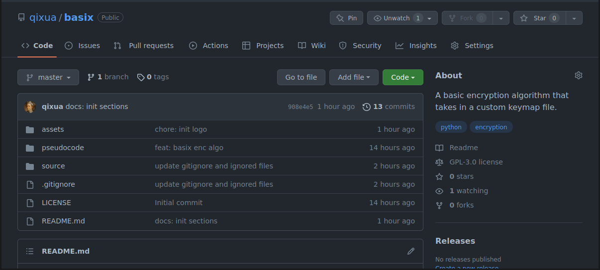
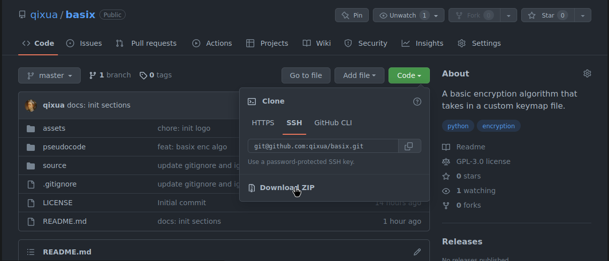

<p align="center">

</p>

<h2 align="center">
    Basix Encryption Algorithm
</h2>

<p align="center">
    A basic algorithm that helps you make your <br/> memorable passwords just a little bit more complex.
</p>

## Table of Contents

- [Installation](https://github.com/qixua/basix#installation)
  - *alternative 1* :: Clone the git repository
  - *alternative 2* :: Use the UI of GitHub.
- [Usage](https://github.com/qixua/basix#usage)
  - (i) Why use this at all?
  - (ii) Making a keymap and storing it
  - (iii) Running the program
- [Copyright](https://github.com/qixua/basix#copyright)

## Installation

**WARNING** This program does not work for Windows *yet*.

- ### *alternative 1* :: Clone the git repository
    **In your terminal, run:**
    ```
    % git clone https://github.com/qixua/basix
    ```
- ### *alternative 2* :: Use the UI of GitHub.
    **a. Go to https://github.com/qixua/basix**

    

    **b. Open the green "Code" dropdown**

    

    **c. Click the Download ZIP option**
    
    
    
    **d. Extract the ZIP**

    Since you like to use the UI to do stuff, just extract it by right clicking.

## Usage

- ### (i) Why use this at all?
   Let's say you have a password manager that you keep your passwords in. How do you backup the master password?
   
   Writing it in a piece of paper is impractical if you use a safe password, and storing it in your computer is very open to hacking.

   With this program, you can create a keymap; put it in your flash drive and plug it whenever you want to get your password.
    
   **What if my flash drive gets stolen?**

   They would only know about your keymap. If you didn't have anything that can be traced back to you in the flash drive or if you picked a password that is not about anything about you like (hobbies, dislikes, etc.) that that keymap is not worth anything to the person who stole it.

- ### (ii) Making a keymap and storing it

    The syntax of a keymap is very easy.

    ```
    charA -> valueA
    charB -> valueB
    .
    .
    .
    ```

    **SYNTAX** Spaces matter. The arrow MUST have one space behind it and after it for the program to succesfully read the keymap.

    **SYNTAX** `charX` must be only one letter. Support for multiple letter chars may come in future versions.

    **SYNTAX** Seperate every mapping by newlines.

    You can name the file anything, add any extension to mask it as something else if you want. It doesn't matter if your file is `myfile.cock`, just input the absolute path. It just works.

- ### (iii) Running the program
    ```
    % cd basix (if you haven't already)
    % python3 source/script.py
    ```

    And then just answer the prompt.


## Copyright
The Basix repository and its code is licensed with GPL v3. Read the LICENSE file for details.